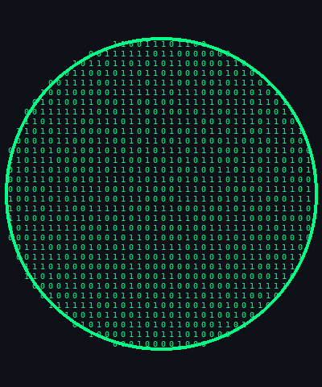
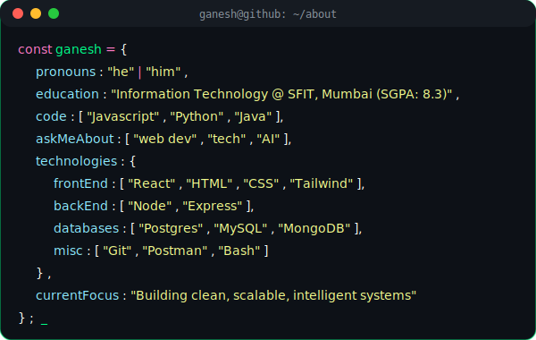
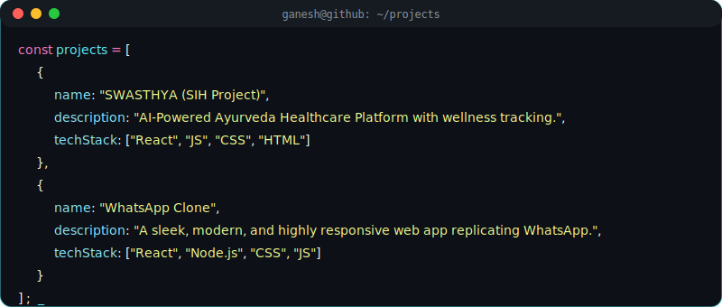

  

  

    
    
    
    
  

  
  

    
    
  

  

### 👨‍💻 About Me

  

### 💻 What I'm Doing Currently

- 🔭 I’m currently working on **[SWASTHYA](https://github.com/ganeshbirajdar286/sih)**
- 👯 I’m looking to collaborate on **Open Source Projects**
- 💬 Ask me about **AI, ML, and Web Development**
- ⚡ Fun fact: **Code Creates Reality**

### 🚀 Projects

  

### ⚙️ Tools & Technologies

  
   
  
   
  
   
  

 

### 📈 GitHub Analytics

  

 

  

---

  

